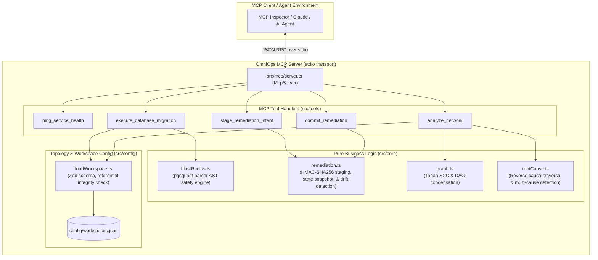

# OmniOps

OmniOps is an operational guardrail and incident analysis server implementing the Model Context Protocol (MCP). It provides LLM coding and operations agents with safety-checked database migration execution, two-phase HMAC-signed remediation with live state-drift verification, and topological incident root-cause analysis based on Tarjan's Strongly Connected Components algorithm.

---

## Architecture



---

## Implemented Pillars

1. **AST SQL Blast-Radius Engine (`src/core/blastRadius.ts`)**:
   - Parses SQL queries into an Abstract Syntax Tree using `pgsql-ast-parser`.
   - Rejects unconstrained `DELETE`/`UPDATE` queries (`BLAST_RADIUS_EXCEEDED: no WHERE clause`).
   - Rejects boolean tautologies such as `WHERE 1=1`, `WHERE TRUE`, `WHERE id = id`, or `WHERE 'a'='a'`.
   - Enforces indexed column bindings on `WHERE` clauses (`BLAST_RADIUS_EXCEEDED: unindexed WHERE`).
   - Unconditionally blocks `DROP TABLE` and `TRUNCATE` in any form (`CASCADE`, `IF EXISTS`, etc.).
   - Recursively inspects Common Table Expressions (`WITH ... DELETE/UPDATE`).
   - Sequentially validates multiple statements split by top-level semicolons.

2. **Two-Phase Dry-Run Commit with HMAC-SHA256 Signatures (`src/core/remediation.ts`)**:
   - **Stage**: Computes a canonical SHA-256 hash of the target live state (`stateSnapshot`), sets an expiration time (`now + 5min`), and signs the payload with a server-side symmetric key (`OMNIOPS_SERVER_SECRET`).
   - **Commit**: Verifies the HMAC signature using constant-time comparison (`crypto.timingSafeEqual`), verifies that `expiresAt` has not elapsed, and re-evaluates the current live state against `stateSnapshot`.
   - **State Drift Protection**: If any racing mutation alters the target state between staging and committing, the commit is aborted (`REMEDIATION_REJECTED: live state drifted from staged snapshot`), preventing stale or duplicate executions.

3. **Topological Causal Dependency Analysis (`src/core/graph.ts`, `src/core/rootCause.ts`)**:
   - Executes Tarjan's Strongly Connected Components algorithm unconditionally on the workspace topology.
   - Condenses cyclic components into super-nodes (acts as a structural no-op on acyclic graphs).
   - Reverse-traverses incoming dependencies to locate the earliest upstream alerting node with zero alerting ancestors.
   - Accurately identifies root causes even when alert notifications arrive out of chronological order.
   - Flags independent, un-linked root causes simultaneously under `possibleMultipleCauses: true`.

4. **Workspace & Topology Configuration (`src/config/loadWorkspace.ts`)**:
   - Loads and validates [`config/workspaces.json`](config/workspaces.json) with Zod.
   - Programmatically enforces node uniqueness and referential integrity (edges may only connect declared nodes).
   - Adding a new workspace requires zero code changes.

---

## Setup & Running Instructions

### Prerequisites
- Node.js >= 20.0.0
- npm >= 10.0.0

### 1. Installation
```bash
# Clone or navigate to the repository
cd OmniOps

# Install dependencies
npm install
```

### 2. Environment Configuration
Create a `.env` file in the project root containing a server secret:
```bash
cp .env.example .env
# Or generate a random 32-byte hex key:
node -e "console.log('OMNIOPS_SERVER_SECRET=' + require('crypto').randomBytes(32).toString('hex'))" > .env
```

### 3. Build & Test
```bash
# Compile TypeScript to dist/
npm run build

# Run full Vitest test suite (42 unit and integration tests)
npm test
```

### 4. Run the Live End-to-End Demo
To see all three pillars execute back to back in a terminal session:
```bash
node dist/demo.js
# Or: npm run demo
```
A live screen recording of all three flows executing in real time is available at [`demo.mov`](demo.mov), with the plain-text execution log preserved at [`demo_session.log`](demo_session.log).

### 5. Running the MCP Server
To start the stdio server directly:
```bash
npm start
# or: node dist/mcp/server.js
```

To inspect and invoke tools interactively using the official MCP Inspector:
```bash
npx @modelcontextprotocol/inspector node dist/mcp/server.js
```

To connect via Claude Desktop, add the following entry to your `claude_desktop_config.json`:
```json
{
  "mcpServers": {
    "omniops": {
      "command": "node",
      "args": ["/absolute/path/to/OmniOps/dist/mcp/server.js"]
    }
  }
}
```

---

## Verification & Audit Disclosures

To maintain strict project integrity, the following implementation and verification details are disclosed:

1. **Client Verification Method**:
   - Phase 1 tool round-trip, Phase 3 blast-radius checks, Phase 4 remediation, and Phase 5 incident analysis were verified using automated Vitest test suites and the official `@modelcontextprotocol/inspector` CLI/Web interface.
   - Verification was **not** conducted through an interactive Claude Desktop GUI session, as Claude Desktop was not installed in this environment.

2. **Destructive Action Backend & State Drift Simulation**:
   - Phase 4's destructive action (`redis_flush_namespace`) was implemented and tested against an in-memory mock backend (`InMemoryRedisBackend`), not against a live external Redis cluster.
   - The "protects against live state drift" guarantee was proven against simulated state transitions in this mock store, not against live multi-tenant network race conditions.

3. **Toolchain Version**:
   - Built and verified with TypeScript **7.0.2** (tagged as `latest` in npm registry at the time of development). Compiled with `tsc` targeting ES2025/NodeNext with strict mode enabled.

4. **Demo Artifact Disclosure (Real Screen Recording & Terminal Session Log)**:
   - A live screen recording covering all three flows executing in real time exists at [`demo.mov`](demo.mov), captured using the built-in macOS `screencapture` CLI tool after Screen Recording permissions were granted in macOS System Settings.
   - The original persistent terminal session log is also retained at [`demo_session.log`](demo_session.log) as an additional documentation artifact of the exact execution output from the run.

---

## Known Limitations

- **Silent Root / Missing-Alert Limitation (Phase 5 Case 3)**:
  If a failure originates at an upstream node that fails to emit an alert (for example, due to an unmonitored component, a total silent crash, or telemetry failure), the causal analysis engine will identify the earliest observable alerting downstream node as the root cause among available observations. Metric-fallback or anomaly detection for silent nodes is deferred beyond v1.
- **Mock State Persistence**:
  The in-memory Redis mock is scoped to the Node process lifetime. Restarting the server resets the mock store to its initial seeded state.

---

## Roadmap / Not Yet Built

- **DuckDB + OpenTelemetry analytics (Phase 7)**:
  Deferred entirely from v1. Spans per tool call and DuckDB Parquet log querying are not implemented.
- **Production Database Runner**:
  Connecting `execute_database_migration` to live PostgreSQL instances via connection pooling and transaction rollbacks.
- **Production Infrastructure Adapters**:
  Real AWS SDK integration for ECS task restarts and live Redis cluster connection for cache invalidation.
- **Automated Metric Fallback**:
  Statistical anomaly detection on metric counters to infer root causes when upstream nodes fail silently without firing explicit alerts.
